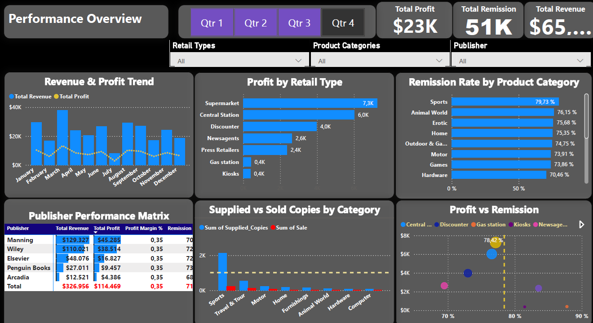
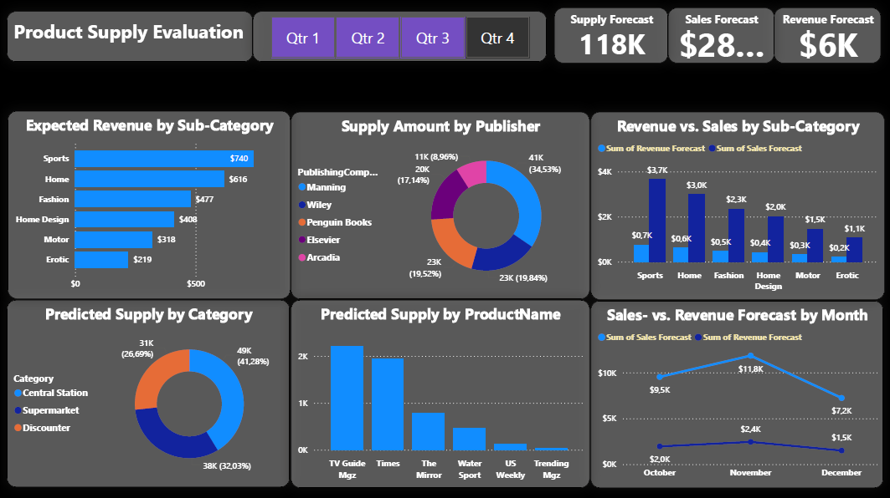

# 📊 First Pane: Power BI Sales Intelligence Dashboard  
### *Interactive Analytics for Press Media Wholesale Distribution. (Pete Chisamba)*

<!-- Language Anchors -->

**Get Translated Version:** [English](README.md) | [German](../DE/README.md)

---

## 🇬🇧 English

### 🧠 **Project Overview**

This Power BI dashboard demonstrates an --end-to-end Business Intelligence use case--, transforming raw transactional data into --actionable sales insights-- for a simulated press media wholesale distributor.

---

### 📰 **Business Scenario**

A regional wholesale distributor acts as an intermediary between **publishing companies** and **retail outlets** such as railway station shops, filling stations, discounters, and kiosks.

Press media products have a **highly perishable lifecycle**—unsold copies become **remissions** after a strict cutoff period (e.g. evening newspapers after midday the following day).

---

### 🎯 **Business Use Case**

Key stakeholders including **CEO**, **Sales Management**, and **Account Managers** require **quarterly performance insights** to:

- Optimize distribution volumes  
- Increase profitability  
- Reduce unsold inventory (remissions)  

---

### 🗄️ **Data Model & ETL**

From a **190-column transactional dataset**, an analytics-ready data model was created using ETL principles.  
Only **business-critical attributes** were retained for reporting and visualization.

#### 🔑 **Vital Variables**

- **Order_ID** – unique identifier per article  
- **Amount** – supplied quantity to retail outlets  
- **Quantity** – actual sales to end customers  
- **Profit** – net profit per product and outlet  
- **Category** – retail channel  
- **Sub-Category** – press media type  
- **Publishing Company** – supplier  

---

### 👤 **Role as Data Analyst**

- Definition of KPIs aligned with business objectives  
- Translation of data into **decision-ready insights**  
- Development of **data-driven storytelling**  

---

### 📌 **Key Performance Indicators (KPIs)**

- **Profit by Product Sub-Category**  
- **Quantity supplied by Publishing Company**  
- **Quantity distributed by Retail Category**  
- **Amount supplied per Product Name**  
- **Quarterly Profit (Q1–Q4)**  

---

### 📈 **Data Visualizations & Storytelling**

#### 🔢 **KPI Cards**

- Total **Supplied Quantity**  
- Total **Sales Quantity**  
- Total **Profit**  

#### 📊 **Bar Charts**

- Profit and Amount by:

  - Category  
  - Sub-Category  
  - Product Name  

#### 🥧 **Pie Charts**

- Distribution share by:

  - Retail category  
  - Publishing company  

---

### 🎥 **Interactive KPI Demonstration**

*Demonstrates filtering, drill-down, and cross-highlighting of KPIs.*

Demonstrates filtering, drill-down, and cross-highlighting of KPIs.*9
---

### 🔍 **Example Key Insights**

1. **Manning Publishing** leads in distribution volume and readership across all quarters
2. Profits decline between **May and August**, peak toward **January**, with reduced sales in December
3. *TV Guide Magazine* shows stable performance, while *Courier & Times* peaks in **Q1 and Q2**
4. **Discounter stores underperform**, while **railway station shops** consistently outperform
5. Product profitability varies significantly by season and content category

---

### 🚀 **Next Steps**

- Cause-effect analysis
- Seasonality modeling
- Audience segmentation
- Demand forecasting to optimize distribution and reduce stockouts

---

## 💡 **Why This Project Matters**

- Demonstrates a strong **Business Intelligence mindset**
- Emphasizes **data-driven decision support**
- Highlights **real-world analytical thinking**
- Ideal showcase for **junior BI / Data Analyst roles**

---
# 📊 Second Pane: Power BI Supply Forecast Dashboard  
### *Product Supply Evaluation & Revenue Prediction*

## 🇬🇧 English

## 🧠 Page Purpose

This dashboard page extends the core BI solution by focusing on **forward-looking supply and revenue forecasts**.

It enables planners and executives to understand:

- where future supply is concentrated  
- which publishers dominate distribution  
- how revenue expectations compare to sales  
- how performance evolves across months and quarters  

---

## 🎯 Executive Questions Answered

- Which **sub-categories** are expected to generate the highest revenue?
- Which **publishers** will drive the largest supply share?
- Are sales forecasts aligned with revenue expectations?
- Which **retail channels** will absorb the majority of stock?
- Is demand improving or declining month over month?

---

## 📌 KPI Cards (Top Row)

- **Supply Forecast → 118K**
- **Sales Forecast**
- **Revenue Forecast**

These provide an instant executive snapshot of expected business volume.

---

## 🎛 Time Navigation

A **Quarter selector (Q1–Q4)** allows decision-makers to simulate seasonal planning and understand how allocations change across the year.

---

## 📊 Visualizations & Business Meaning

### Expected Revenue by Sub-Category
Ranks content types such as **Sports, Home, Fashion** by predicted revenue contribution.

➡ Helps decide:
- assortment strategy  
- shelf prioritization  
- promotional focus

---

### Supply Amount by Publisher
Donut chart showing distribution share among:

- Manning  
- Wiley  
- Penguin  
- Elsevier  
- Arcadia  

➡ Used for supplier dependency evaluation and negotiation preparation.

---

### Revenue vs. Sales by Sub-Category
Cluster comparison between expected sales volume and revenue.

➡ Reveals:
- monetization efficiency  
- pricing vs. volume dynamics  
- potential margin pressure

---

### Predicted Supply by Retail Category
Shows allocation to:

- Central Station  
- Supermarket  
- Discounter  

➡ Supports logistics and channel prioritization.

---

### Predicted Supply by Product Name
Identifies blockbuster titles (e.g., TV Guide, Times) versus niche products.

➡ Critical for:
- print run planning  
- return-risk mitigation

---

### Sales vs. Revenue Forecast by Month
Trend view across **October → November → December**.

➡ Highlights:
- peak demand periods  
- upcoming slowdowns  
- timing of operational pressure

---

## 🔍 Key Takeaways from the Page

- A small group of publishers drives a large portion of supply.
- Revenue concentration is strongest in a few content categories.
- November appears as the forecasted peak month.
- Some categories show high volume but limited revenue lift.
- Distribution is heavily dependent on central station channels.

---

## 🛠 Analytical Value

This page transforms forecast numbers into **planning intelligence**.

It allows:
✔ proactive allocation  
✔ supplier strategy  
✔ risk anticipation  
✔ improved financial predictability

---
